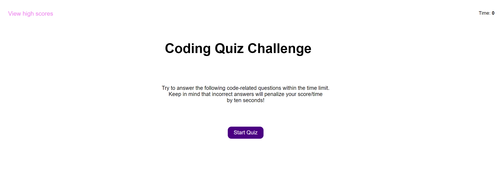

# Code Quiz

## Description
This project is a timed coding quiz with multiple-choice questions.

## Technologies
Project is created using:
* HTML5
* CSS3
* JavaScript

## Mockup

## Installation
To install the project on your local machine:

1) Clone or download the repository to your own local machine.
2) Open the HTML file in your browser.

## Link URL to deployed app
https://kateredkina.github.io/code-quiz/

## Link URL to GitHub Repository
https://github.com/KateRedkina/code-quiz